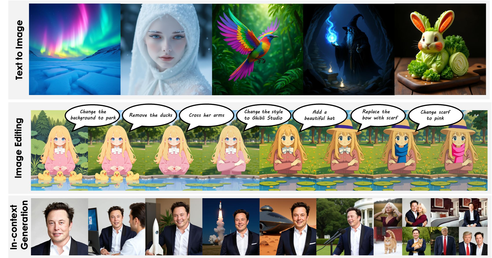

<h1 align="center">OmniGen2</h1>

<p align="center">
  <a href="https://github.com/VectorSpaceLab/OmniGen2"></a>
  <a href=""></a>
  <a href=""></a>
  <a href=""></a>
</p>

<h4 align="center">
    <p>
        <a href=#1-news>News</a> |
        <a href=#3-methodology>Methodology</a> |
        <a href=#4-what-can-omnigen-do>Capabilities</a> |
        <a href=#5-quick-start>Quick Start</a> |
        <a href="#6-finetune">Finetune</a> |
        <a href="#license">License</a> |
        <a href="#citation">Citation</a>
    <p>
</h4>

<p align="center"></p>

## 🔥 News
- **2025-06-16**: [Gradio](https://github.com/VectorSpaceLab/OmniGen2?tab=readme-ov-file#-gradio-demo) and [Jupyter](https://github.com/VectorSpaceLab/OmniGen2/blob/main/example.ipynb) demo is available.
- **2025-06-16**: We release **OmniGen2**, a multimodal generation model, model weights can be accessed in [huggingface](https://huggingface.co/OmniGen2/OmniGen2).

## 📌 TODO
- [ ] Technical report.
- [ ] Training data and pipeline scripts.
- [ ] In-context generation benchmark: **OmniContext**.
- [ ] ComfyUI and Replicate Demo (**commuity support will be greatly appreciated!**).

## 🚀 Quick Start

### 🛠️ Environment Setup

#### ✅ Recommended Setup

```bash
# 1. Clone the repo
git clone git@github.com:VectorSpaceLab/OmniGen2.git
cd OmniGen2

# 2. (Optional) Create a clean Python environment
conda create -n omnigen2 python=3.11
conda activate omnigen2

# 3. Install dependencies
# 3.1 Install PyTorch (choose correct CUDA version)
pip install torch==2.6.0 torchvision --extra-index-url https://download.pytorch.org/whl/cu124

# 3.2 Install other required packages
pip install -r requirements.txt
pip install flash-attn --no-build-isolation
```

#### 🌏 For users in Mainland China

```bash
# Install PyTorch from a domestic mirror
pip install torch==2.6.0 torchvision --index-url https://mirror.sjtu.edu.cn/pytorch-wheels/cu124

# Install other dependencies from Tsinghua mirror
pip install -r requirements.txt -i https://pypi.tuna.tsinghua.edu.cn/simple
pip install flash-attn --no-build-isolation -i https://pypi.tuna.tsinghua.edu.cn/simple
```

---

### 🧪 Run Examples

```bash
# Visual Understanding
bash example_understanding.sh

# Text-to-image generation
bash example_t2i.sh

# Instruction-guided image editing
bash example_edit.sh

# Subject-driven image editing
bash example_subject_driven_edit.sh
```

---

### 🌐 Gradio Demo

* **Online Demo**: [Available on Hugging Face Spaces 🚀](https://huggingface.co/spaces/Shitao/OmniGen2)

* **Run Locally**:

```bash
pip install gradio
python app.py
# Optional: Share demo with public link
python app.py --share
```

## 💡 Usage Tips
To achieve optimal results with OmniGen2, you can adjust the following key hyperparameters based on your specific use case.
- `num_inference_step`: The number of sampling steps per generation. Higher values generally improve quality but increase generation time.
    - Recommended Range: 28 to 50
- `text_guidance_scale`: Controls how strictly the output adheres to the text prompt (Classifier-Free Guidance).
    - **For Text-to-Image**: Use a higher value (e.g., 6-7) for simple or less detailed prompts. Use a lower value (e.g., 4) for complex and highly detailed prompts.
    - **For Editing/Composition**: A moderate value around 4-5 is recommended.
- `image_guidance_scale`: This controls how much the final image should resemble the input reference image.
    - **The Trade-off**: A higher value (~2.0) makes the output more faithful to the reference image's structure and style, but it might ignore parts of your text prompt. A lower value (~1.5) gives the text prompt more influence.
    - **Tip**: Start with 1.5 and increase it if you need more consistency with the reference image.
- `max_input_image_pixels`: To manage processing speed and memory consumption, reference images exceeding this total pixel count will be automatically resized.
- `negative_prompt`: Tell the model what you don't want to see in the image.
    - **Example**: blurry, low quality, text, watermark
    - **Tip**: For the best results, try experimenting with different negative prompts. If you're not sure, just leave it blank.

## Resources Requirement
OmniGen2 require around 21G GPU memory for BF16 inference. For users do not have such GPU memory, may try:


## :heart: Citing Us
If you find this repository or our work useful, please consider giving a star :star: and citation :t-rex:, which would be greatly appreciated:

```bibtex
@article{xiao2024omnigen,
  title={Omnigen: Unified image generation},
  author={Xiao, Shitao and Wang, Yueze and Zhou, Junjie and Yuan, Huaying and Xing, Xingrun and Yan, Ruiran and Wang, Shuting and Huang, Tiejun and Liu, Zheng},
  journal={arXiv preprint arXiv:2409.11340},
  year={2024}
}
```

## License
This work is licensed under Apache 2.0 license.
