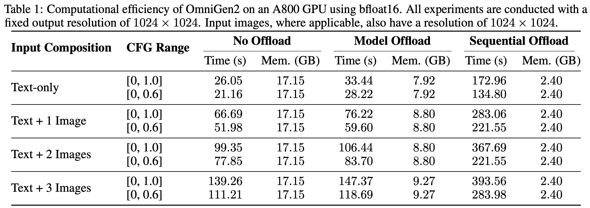

<!-- <h1 align="center">OmniGen2</h1> -->
<p align="center">
  
</p>

<p align="center">
  <a href="https://github.com/VectorSpaceLab/OmniGen2"></a>
  <a href=""></a>
  <a href=""></a>
  <a href="https://huggingface.co/OmniGen2/OmniGen2"></a>
  <a href=""></a>
  <a href=""></a>
</p>

<h4 align="center">
    <p>
        <a href=#-news>News</a> |
        <a href=#-quick-start>Quick Start</a> |
        <a href=#-usage-tips>Usage Tips</a> |
        <a href=#-gradio-demo>Online Demos</a> |
        <a href="#heart-citing-us">Citation</a> |
        <a href="#license">License</a>
    <p>
</h4>

## 🔥 News
- **2025-06-20**: Updated [resource requirements](#-resources-requirement), adding CPU offload support for devices with limited VRAM.
- **2025-06-16**: [Gradio](https://github.com/VectorSpaceLab/OmniGen2?tab=readme-ov-file#-gradio-demo) and [Jupyter](https://github.com/VectorSpaceLab/OmniGen2/blob/main/example.ipynb) is available.
- **2025-06-16**: We release **OmniGen2**, a multimodal generation model, model weights can be accessed in [huggingface](https://huggingface.co/OmniGen2/OmniGen2) and [modelscope](https://www.modelscope.cn/models/OmniGen2/OmniGen2).


## Introduction
**OmniGen2** is a powerful and efficient unified multimodal model. Its architecture is composed of two key components: a 3B Vision-Language Model (VLM) and a 4B diffusion model. This dual-component architecture enables strong performance across four primary capabilities:

- **Visual Understanding**: Inherits the robust ability to interpret and analyze image content from its Qwen-VL-2.5 foundation.
- **Text-to-Image Generation**: Creates high-fidelity and aesthetically pleasing images from textual prompts.
- **Instruction-guided Image Editing**: Executes complex, instruction-based image modifications with high precision, achieving state-of-the-art performance among open-source models.
- **In-context Generation**: A versatile capability to process and flexibly combine diverse inputs—including humans, reference objects, and scenes—to produce novel and coherent visual outputs.

As an open-source project, OmniGen2 provides a powerful yet resource-efficient foundation for researchers and developers exploring the frontiers of controllable and personalized generative AI.

**We will release the training code, dataset, and data construction pipeline soon. Stay tuned!**

<p align="center">
  
  <br>
  <em>Demonstration of OmniGen2's overall capabilities.</em>
</p>

<p align="center">
  
  <br>
  <em>Demonstration of OmniGen2's image editing capabilities.</em>
</p>

<p align="center">
  
  <br>
  <em>Demonstration of OmniGen2's in-context generation capabilities.</em>
</p>


## 📌 TODO
- [ ] Technical report.
- [ ] In-context generation benchmark: **OmniContext**.
- [x] Support CPU offload and improve inference efficiency.
- [ ] Integrated in diffusers.
- [ ] Training data and scripts.
- [ ] Data construction pipeline.
- [ ] ComfyUI Demo (**commuity support will be greatly appreciated!**).

## 🚀 Quick Start

### 🛠️ Environment Setup

#### ✅ Recommended Setup

```bash
# 1. Clone the repo
git clone git@github.com:VectorSpaceLab/OmniGen2.git
cd OmniGen2

# 2. (Optional) Create a clean Python environment
conda create -n omnigen2 python=3.11
conda activate omnigen2

# 3. Install dependencies
# 3.1 Install PyTorch (choose correct CUDA version)
pip install torch==2.6.0 torchvision --extra-index-url https://download.pytorch.org/whl/cu124

# 3.2 Install other required packages
pip install -r requirements.txt

# Note: Version 2.7.4.post1 is specified for compatibility with CUDA 12.4.
# Feel free to use a newer version if you use CUDA 12.6 or they fixed this compatibility issue.
pip install flash-attn==2.7.4.post1 --no-build-isolation
```

#### 🌏 For users in Mainland China

```bash
# Install PyTorch from a domestic mirror
pip install torch==2.6.0 torchvision --index-url https://mirror.sjtu.edu.cn/pytorch-wheels/cu124

# Install other dependencies from Tsinghua mirror
pip install -r requirements.txt -i https://pypi.tuna.tsinghua.edu.cn/simple

# Note: Version 2.7.4.post1 is specified for compatibility with CUDA 12.4.
# Feel free to use a newer version if you use CUDA 12.6 or they fixed this compatibility issue.
pip install flash-attn==2.7.4.post1 --no-build-isolation -i https://pypi.tuna.tsinghua.edu.cn/simple
```

---

### 🧪 Run Examples

```bash
# Visual Understanding
bash example_understanding.sh

# Text-to-image generation
bash example_t2i.sh

# Instruction-guided image editing
bash example_edit.sh

# In-context generation
bash example_in_context_generation.sh
```

---

### 🌐 Gradio Demo

* **Online Demo**:
We are temporarily providing 8 GPUs to support the online demos. If you notice a long queue for a particular link, please try other links:

    [Demo1](https://be5916033313307354.gradio.live), [Demo2](https://281efc44b736406f42.gradio.live), [Demo3](https://a27912fbaef54294f8.gradio.live), [Demo4](https://bbf305e391bc769d22.gradio.live)

    [Chat-Demo1](https://a79e0445bb498554e8.gradio.live), [Chat-Demo2](https://7f922fdca66e47c427.gradio.live), [Chat-Demo3](https://6568f4b2a8353be3ae.gradio.live), [Chat-Demo4](https://f38c30ed99f0f6caab.gradio.live)

<!-- [Available on Hugging Face Spaces 🚀](https://huggingface.co/spaces/Shitao/OmniGen2) -->

* **Run Locally**:
    ```bash
    # for only generating image
    pip install gradio
    python app.py
    # Optional: Share demo with public link (You need to be able to access huggingface)
    python app.py --share

    # for generating image or text
    pip install gradio
    python app_chat.py
    ```

## 💡 Usage Tips
To achieve optimal results with OmniGen2, you can adjust the following key hyperparameters based on your specific use case.
- `text_guidance_scale`: Controls how strictly the output adheres to the text prompt (Classifier-Free Guidance).
- `image_guidance_scale`: This controls how much the final image should resemble the input reference image.
    - **The Trade-off**: A higher value makes the output more faithful to the reference image's structure and style, but it might ignore parts of your text prompt. A lower value (~1.5) gives the text prompt more influence.
    - **Tip**: For image editing task, we recommend to set it between 1.2 and 2.0; for in-context generateion task, a higher image_guidance_scale will maintian more details in input images, and we recommend to set it between 2.5 and 3.0.
- `max_pixels`: Automatically resizes images when their total pixel count (width × height) exceeds this limit, while maintaining its aspect ratio. This helps manage performance and memory usage.
  - **Tip**: Default value is 1024*1024. You can reduce this value if you encounter memory issues.
- `max_input_image_side_length`: Maximum side length for input images.
- `negative_prompt`: Tell the model what you don't want to see in the image.
    - **Example**: blurry, low quality, text, watermark
    - **Tip**: For the best results, try experimenting with different negative prompts. If you're not sure, just use the default negative prompt.
- `enable_model_cpu_offload`: **Reduces VRAM usage by nearly 50% with a negligible impact on speed**.
  - This is achieved by offloading the model weights to CPU RAM when they are not in use.
  - See: [Model Offloading](https://huggingface.co/docs/diffusers/optimization/memory#model-offloading)
- `enable_sequential_cpu_offload`: Minimizes VRAM usage to less than 3GB, but at the cost of significantly slower performance.
  - This works by offloading the model in submodules and loading them onto the GPU sequentially as needed.
  - See: [CPU Offloading](https://huggingface.co/docs/diffusers/optimization/memory#cpu-offloading)
- `cfg_range_start`, `cfg_range_end`: Define the timestep range where CFG is applied. Per this [paper](https://arxiv.org/abs/2404.07724), reducing cfg_range_end can significantly decrease inference time with a negligible impact on quality.
  
**Some suggestions for improving generation quality:**
- Use high-resolution and high-quality images. Images that are too small or blurry will also result in low-quality output. We recommend ensuring that the input image size is greater than 512 whenever possible.
- Provide detailed instructions. For in-context generation tasks, specify which elements from which image the model should use.
- Try to use English as much as possible, as OmniGen2 currently performs better in English than in Chinese.


## 💻 Resources Requirement
OmniGen2 natively requires an **NVIDIA RTX 3090** or an equivalent GPU with approximately **17GB of VRAM**. For devices with less VRAM, you can enable **CPU Offload** to run the model.

**Performance Tip**: To improve inference speed, consider decreasing the `cfg_range_end` parameter. Within a reasonable range, this has a negligible impact on output quality.

The following table details the inference performance of OmniGen2 on an **A800 GPU**:
<p align="center">
  
  <br>
  <em>Inference Efficiency of OmniGen2.</em>
</p>

## ❤️ Citing Us
If you find this repository or our work useful, please consider giving a star ⭐ and citation 🦖, which would be greatly appreciated (OmniGen2 report will be available as soon as possible):

```bibtex
@article{xiao2024omnigen,
  title={Omnigen: Unified image generation},
  author={Xiao, Shitao and Wang, Yueze and Zhou, Junjie and Yuan, Huaying and Xing, Xingrun and Yan, Ruiran and Wang, Shuting and Huang, Tiejun and Liu, Zheng},
  journal={arXiv preprint arXiv:2409.11340},
  year={2024}
}
```

## License
This work is licensed under Apache 2.0 license.
